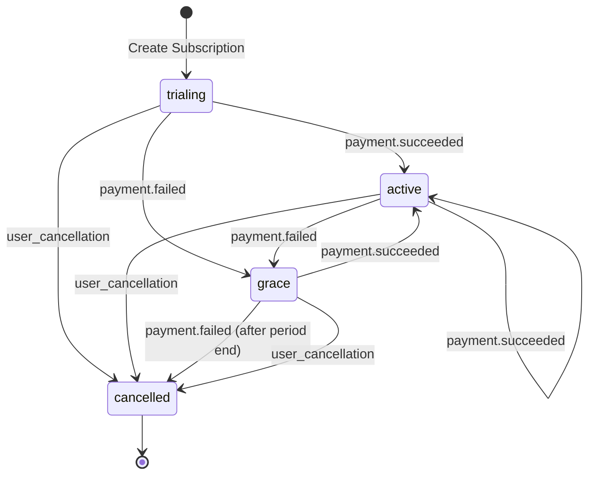
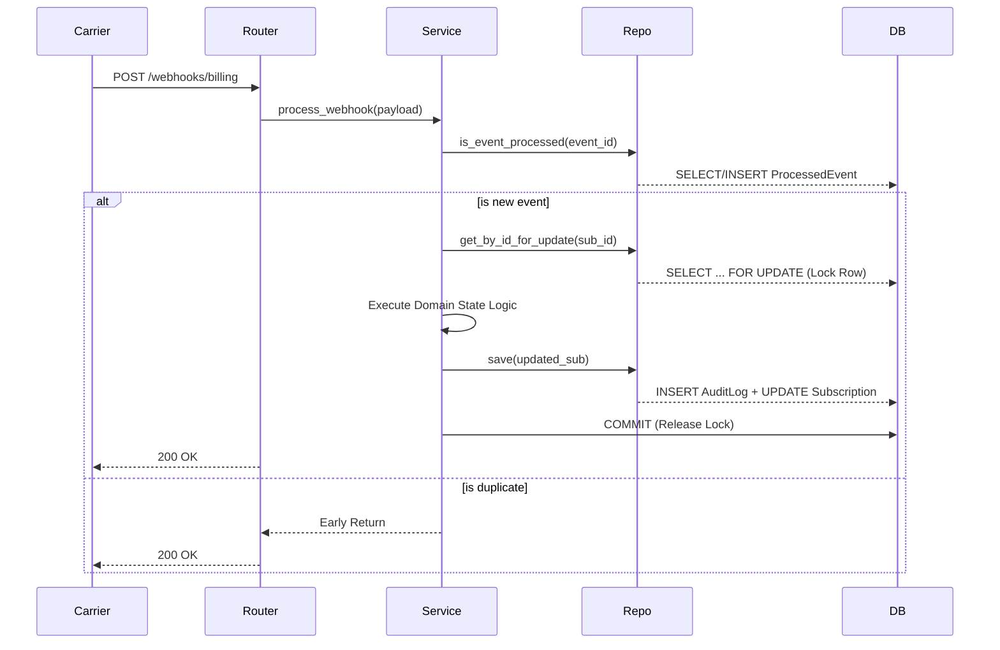

# Subscription Management API

A production-ready FastAPI application built using **Clean Architecture** principles to manage user subscriptions and billing lifecycle events.

## Quick Start

### Prerequisites
- Docker and Docker Compose

### Run the Application
```bash
docker-compose up --build
```
The API will be available at `http://localhost:8000`. You can access the interactive Swagger documentation at `http://localhost:8000/docs`.

### Run Tests
```bash
docker exec subscription-api python -m pytest
```

---

## Architecture

The project follows a **Strict Clean Architecture** (layered) approach to ensure business logic remains decoupled from external frameworks and databases.

### Layer Breakdown
1.  **Domain Layer (`app/state.py`)**: Contains the core `Subscription` state machine. It is written in pure Python with no external dependencies (database or framework), making it highly testable and robust.
2.  **Service Layer (`app/services.py`)**: Orchestrates the application flow. It coordinates between the domain logic and the persistence layer, managing database transactions (Unit of Work).
3.  **Data Access Layer (`app/repo.py`)**: Handles all communication with the PostgreSQL database. It includes row-level locking (`FOR UPDATE`) for concurrency safety and automatic audit logging.
4.  **Interface Layer (`app/routers/`)**: "Dumb" FastAPI routers that handle HTTP request translation, validation, and schema serialization.

---

## System Diagrams

### Subscription State Machine
This diagram shows how a subscription transitions between different states based on payment events and user actions.



### Webhook Processing Flow
This diagram illustrates the data flow and concurrency control when a billing webhook is received.



---

## API Endpoints

### Subscriptions

#### Create a new subscription
Starts a 7-day free trial.
```bash
curl -X POST http://localhost:8000/subscriptions/
```

#### Get subscription status
```bash
curl -X GET http://localhost:8000/subscriptions/{subscription_id}
```

#### Cancel a subscription
```bash
curl -X POST http://localhost:8000/subscriptions/{subscription_id}/cancel
```

#### Get audit history
```bash
curl -X GET http://localhost:8000/subscriptions/{subscription_id}/history
```

### Webhooks

#### Process billing event
Simulate a payment success or failure from the carrier.
```bash
curl -X POST http://localhost:8000/webhooks/billing \
     -H "Content-Type: application/json" \
     -d '{
           "event_id": "evt_123456",
           "subscription_id": "{subscription_id}",
           "timestamp": "2026-06-01T12:00:00Z",
           "amount": 29.99
         }'
```

---

## Tech Stack
- **Framework**: FastAPI
- **Database**: PostgreSQL
- **ORM**: SQLAlchemy
- **Environment**: Docker / Docker Compose
- **Testing**: Pytest
- **Validation**: Pydantic v2
